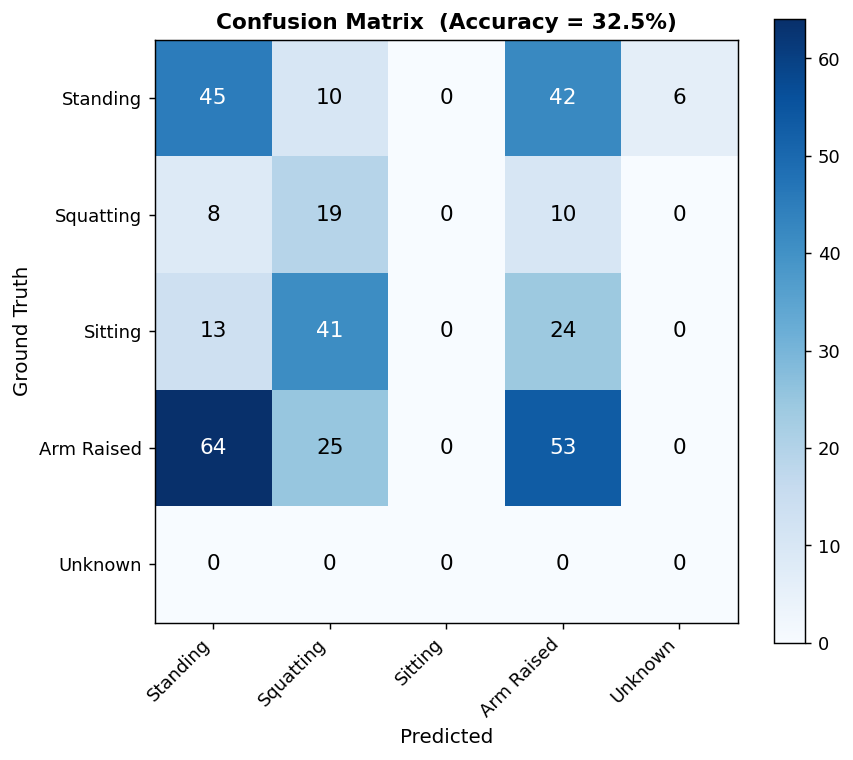

# Human-Activity-Recognition-via-Pose-Estimation

This project implements a Human Activity Recognition pipeline using Computer Vision and Pose Estimation techniques.

## 📌 Project Overview

The system detects human body keypoints from video frames using MediaPipe Pose, computes joint angles, applies smoothing techniques, and classifies activities using rule-based logic.

Activities classified:
- Standing
- Sitting
- Hand Raising
- Squatting

---

## 🚀 Features

- Pose Detection using MediaPipe
- Skeleton Visualization
- Joint Angle Computation
- Angle Smoothing
- Rule-Based Activity Classification
- Confusion Matrix & Performance Evaluation
- Activity Transition Detection

---

## 📂 Project Structure

```text
Human-Activity-Recognition/
│
├── CV_CCP_Human_Activity_Recognition.ipynb
├── README.md
├── requirements.txt
│
├── Graphs_Output/
│   ├── activity-distribution.png
│   ├── angles-and-transition.png
│   ├── confusion-matrix.png
│   ├── joint-angles-raw-vs-smoothed.png
│   ├── sample-skeleton-overlay.png
```

---

## 🎥 Demo Video

Since GitHub does not support large video uploads directly, the demo video is provided through an external link.

Video Link:
[DEMO VIDEO](https://www.pexels.com/video/a-woman-doing-a-squat-exercise-7690495/)

---

## 🛠️ Technologies Used

- Python
- OpenCV
- MediaPipe
- NumPy
- Pandas
- Matplotlib
- Scikit-learn

---

## 📊 Output Visualizations

### Sample Skeleton Overlay
(Add image here)

### Joint Angles Raw vs Smoothed
(Add image here)

### Activity Distribution
(Add image here)

### Confusion Matrix


---

## 📈 Accuracy Evaluation

The activity classification was evaluated using manually labeled ground truth data and achieved good performance for the selected activities.

---

## ▶️ How to Run

1. Clone the repository

```bash
git clone YOUR_GITHUB_REPO_LINK
```

2. Install dependencies

```bash
pip install -r requirements.txt
```

3. Open the notebook

```bash
jupyter notebook
```

4. Run all cells

---

## 📄 Course Information

Course: Computer Vision  
Assignment: Complex Computing Problem (CCP)

---

## 👨‍💻 Author

Your Name Here
